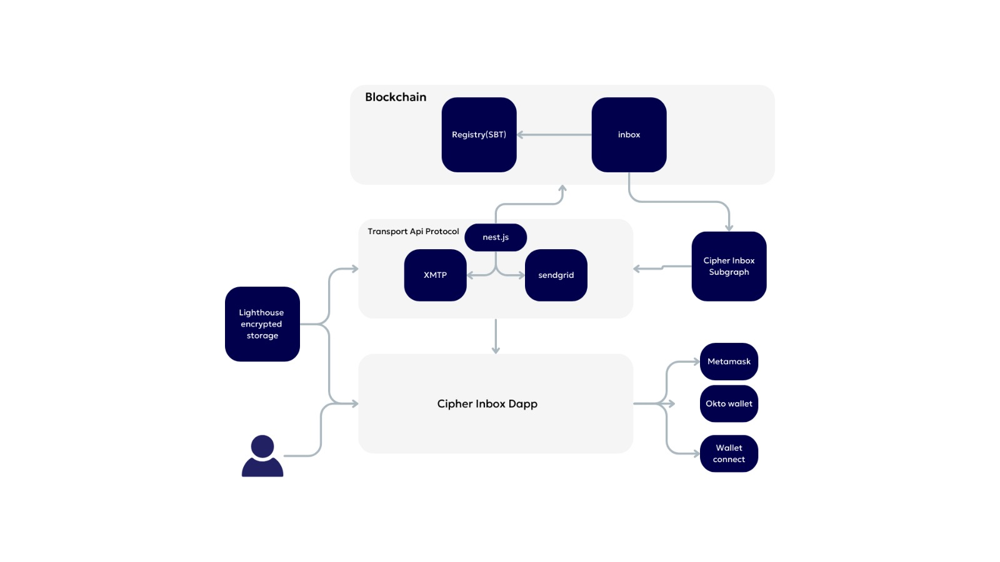

# ETHGlobal_India_2023_Web3_Email

# CipherInbox

## Summary
CipherInbox: CipherInbox, with its emphasis on Web3 technology and privacy-focused features, is well-equipped to address several common challenges associated with traditional email services.

## Problem & opportunity
Web2 emails are not focused on privacy at all. There's a saying in the tech world: if you are not paying for the product, then you are the product. Users are basically exchanging their privacy and data in order to use the email service. This presents a good opportunity for users who care about their personal privacy.

Some of the problems with current Web2 emails:
- Privacy concerns
- Centralized storage risks
- Too many spams

## Solution
CipherInbox, with its emphasis on Web3 technology and privacy-focused features, is well-equipped to address several common challenges associated with traditional email services.

Key Features:

End-to-End Encryption: Your messages are shielded with cutting-edge encryption, ensuring that only the intended recipient can unlock and read them.

Web3 Integration: Harness the potential of blockchain technology by linking your wallet directly to your email, making your communications more secure than ever.

Decentralized Security: With our decentralized architecture, your data is distributed across the blockchain, eliminating single points of failure and enhancing the robustness of your digital communications.

User-Friendly Interface: CipherInbox is designed for simplicity without compromising security. Experience seamless navigation and a user-friendly interface that prioritizes your privacy.

Private Keys, Your Control: Your private keys remain in your hands, giving you complete control over your digital identity and ensuring the utmost confidentiality in your conversations.

### Technology architecture

## User Flow:
Sign up for an email --> choose the desired username --> send an email or chat with their friends --> explore the world of Web3 email

## Future Work
Some thoughts for how the whole project can be built out further:
- Integrate and build out other features, including video chat
- Use 1 main blockchain to handle the storage of data

## Deployed contract (all verified)
### Polygon zkEVM testnet (chainID: 1442)
| Contract |                           Contract address |
| CipherInboxRegistry | 0xbf3A31163e7DF1fF05dD683f92Cd9F8ac7ecC276 |
| CipherInbox         | 0xBfd22a53e5Be040d68c35041b499a8a51913a5F8 |
Verified contract links: https://testnet-zkevm.polygonscan.com/address/0xbf3A31163e7DF1fF05dD683f92Cd9F8ac7ecC276#code
https://testnet-zkevm.polygonscan.com/address/0xBfd22a53e5Be040d68c35041b499a8a51913a5F8#code

### Scroll Sepolia Testnet  (chainID: 534351)
| Contract |                           Contract address |
| CipherInbox         | 0x486098dE87321a5DBe79ACeAA10f5DC11E0fD2b7 |
| CipherInboxRegistry | 0xdbfDa4b19ff56230A75a11ef4011EaEB63181867 |
Verified contract address: https://sepolia.scrollscan.dev/address/0x486098de87321a5dbe79aceaa10f5dc11e0fd2b7#code

### Celo Alfajores Testnet (chainID: 44787)
| Contract    |                           Contract address |
| CipherInbox         | 0x486098dE87321a5DBe79ACeAA10f5DC11E0fD2b7 |
| CipherInboxRegistry | 0xdbfDa4b19ff56230A75a11ef4011EaEB63181867 |
The verified smart contract on Celo Alfajores is:
https://alfajores.celoscan.io/address/0x486098dE87321a5DBe79ACeAA10f5DC11E0fD2b7#code

### Base Goerli testnet (chainID: 84531)
| Contract    |                           Contract address |
| CipherInbox |  0xdbfDa4b19ff56230A75a11ef4011EaEB63181867|
| CipherInboxRegistry | 0x0523473DA7DC648861573dAE800eDA1dC49A6B8a |
The verified smart contract on Base Goerli testnet is:
https://goerli.basescan.org/address/0xdbfDa4b19ff56230A75a11ef4011EaEB63181867#code

### Arbitrum Goerli testnet (chainID: 421613)
| Contract    |                           Contract address |
| CipherInbox |  0x33d9D78b2a0E758E0EABc76f96986a0D0d3aca5D|
| CipherInboxRegistry | 0xED629E6fCf5205ab37DF3d19e6932501348415bb |
The verified smart contract on Arbitrum Goerli testnet is:
https://goerli.arbiscan.io/address/0x33d9D78b2a0E758E0EABc76f96986a0D0d3aca5D#code

### Mantle testnet (chainID: 5001)
| Contract    |                           Contract address |
| CipherInbox | 0x925293d6A98781642702eC4EE8529994D12b783f |
| CipherInboxRegistry | 0xB86818089aa2B513BE3f639A77E78d379f241a55   |
The verified smart contract for Mantle testnet is:
https://explorer.testnet.mantle.xyz/address/0x485247D991959C04A2D80a625647adD3Ce45CE6C
https://explorer.testnet.mantle.xyz/address/0xB86818089aa2B513BE3f639A77E78d379f241a55/contracts#address-tabs

## Others

### Demo movie

### Demo site
https://eth-global-india-2023-web3-email.vercel.app/

### How to run locally
1. Go to the dapp (frontend) folder
2. npm install
3. npm dev
